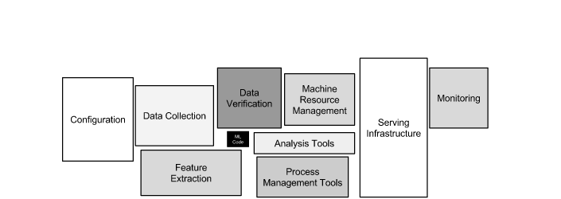

Traditionally Object Detection and Instance segmentation are dealt as supervisedlearning problems with labelled class and bounding boxes, pixel masks respectively.
with techniques like (guided back propagation,CAM,grad CAM) provides interpretability of where the network is looking at, in the input image. Thuis localisation can be considered as weakly labelled instance localisation as we can localise based on class labels only avoiding the need for instance boundary labels. However the accuracy of these models is less than a complete supervised procedure(Add ref)

### GRAD CAM
Grad cam uses the gradients flowing into the last convolution to produce a coarse localisation map highlighting the important regions.
REFERENCE
1. (REF Grad cam paper)
2. 
